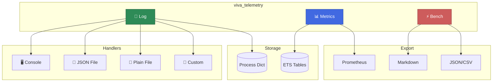
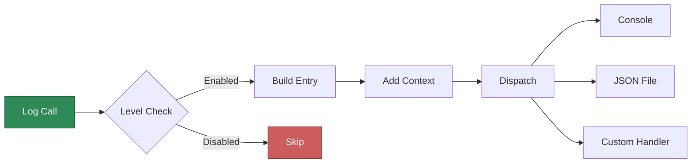
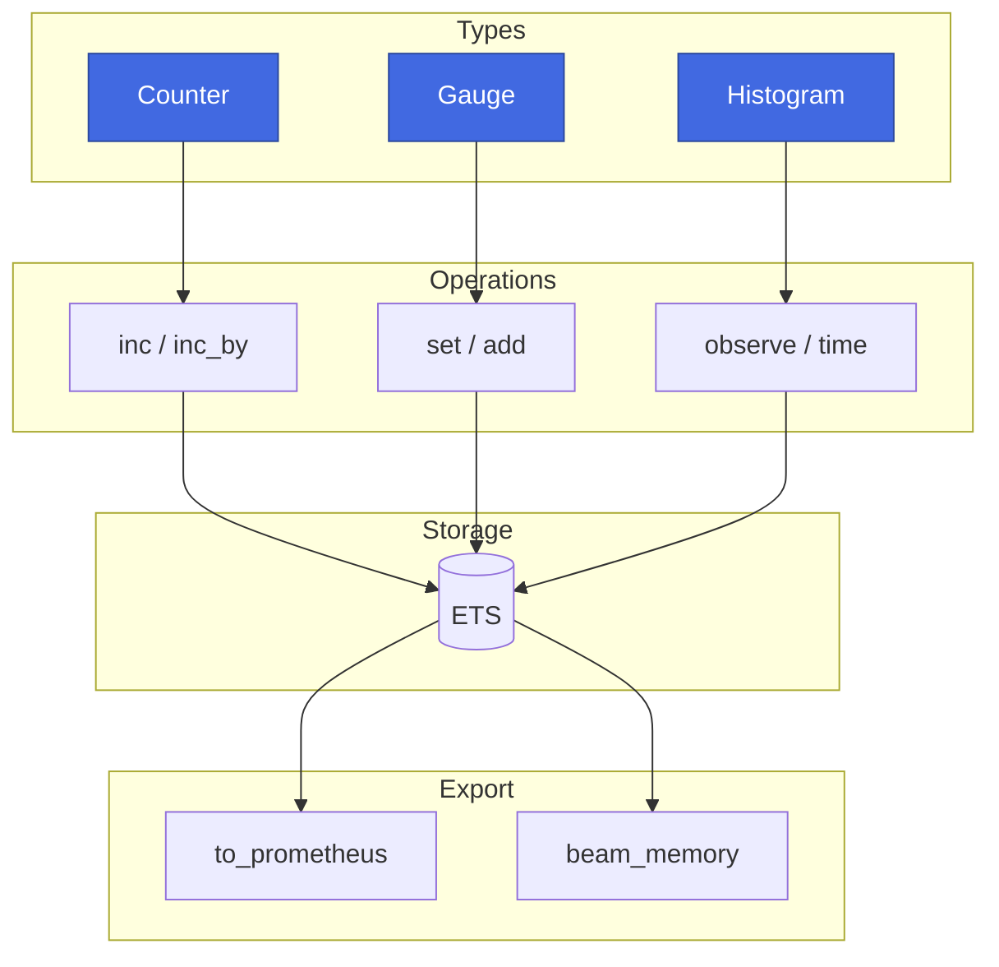
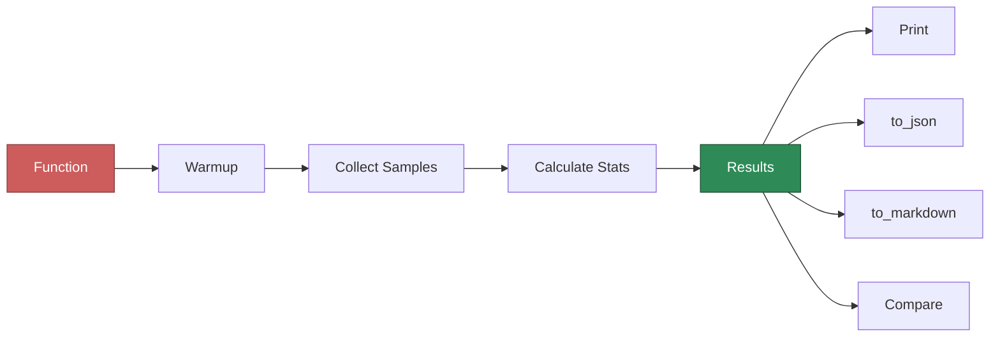
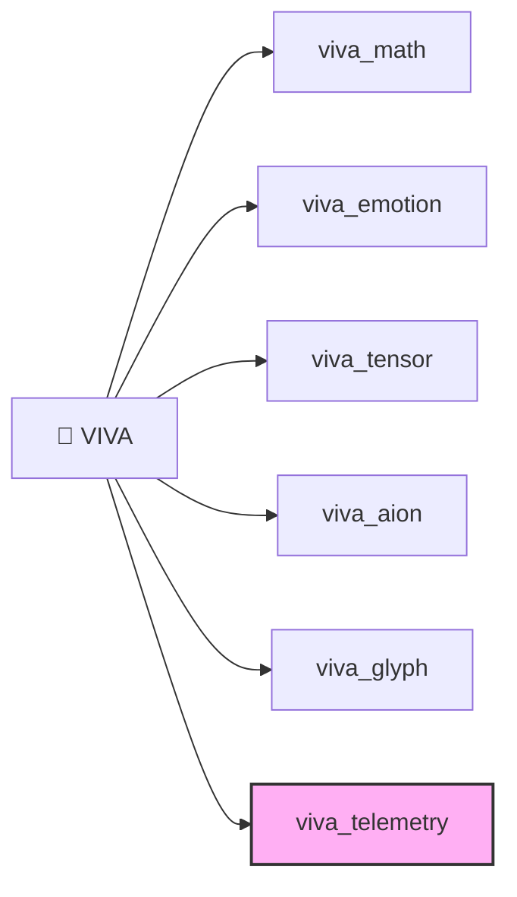

<p align="center">
  
</p>

<p align="center">
  
  <a href="https://github.com/gabrielmaialva33/viva_telemetry/actions"></a>
  <a href="https://hex.pm/packages/viva_telemetry"></a>
  <a href="https://hexdocs.pm/viva_telemetry"></a>
  
</p>

<p align="center">
  <b>Professional observability suite for Gleam</b><br/>
  <sub>Structured logging • Metrics collection • Statistical benchmarking</sub>
</p>

---

## Install

```sh
gleam add viva_telemetry@1
```

## Architecture



## Quick Start

```gleam
import viva_telemetry/log
import viva_telemetry/metrics
import viva_telemetry/bench

pub fn main() {
  // 📝 Logging - one import setup!
  log.configure_console(log.debug_level)
  log.info("Server started", [#("port", "8080")])

  // 📊 Metrics
  let requests = metrics.counter("http_requests")
  metrics.inc(requests)

  // ⚡ Benchmarking
  bench.run("my_function", fn() { heavy_work() })
  |> bench.print()
}
```

---

## 📝 Logging



### Features

| Feature | Description |
|---------|-------------|
| **RFC 5424 Levels** | Emergency → Trace (9 levels) |
| **Structured Fields** | Key-value pairs with every log |
| **Context Propagation** | Inherit fields in nested calls |
| **Lazy Evaluation** | Avoid string construction when disabled |
| **Sampling** | Log only N% of high-volume messages |
| **Multiple Handlers** | Console, JSON, File, Custom |

### Usage

```gleam
// Quick setup (one import!)
log.configure_console(log.debug_level)

// Structured logging
log.info("User logged in", [#("user_id", "42"), #("ip", "192.168.1.1")])

// Context propagation
log.with_context([#("request_id", "abc123")], fn() {
  log.debug("Processing...")  // inherits request_id
})

// Lazy evaluation - avoid string construction when disabled
log.debug_lazy(fn() { "Heavy: " <> expensive_to_string(data) }, [])

// Sampling for high-volume logs (1% of messages)
log.sampled(log.trace_level, 0.01, "Hot path", [])
```

### Handlers

```gleam
log.configure_console(log.info_level)           // Console only
log.configure_json("app.jsonl", log.debug_level) // JSON file
log.configure_full(log.debug_level, "app.jsonl", log.info_level) // Both
```

---

## 📊 Metrics



### Metric Types

| Type | Use Case | Operations |
|------|----------|------------|
| **Counter** | Requests, errors, events | `inc()`, `inc_by(n)` |
| **Gauge** | Connections, queue size | `set(v)`, `add(v)`, `inc()`, `dec()` |
| **Histogram** | Latency, response sizes | `observe(v)`, `time(fn)` |

### Usage

```gleam
// Counter (monotonically increasing)
let requests = metrics.counter("http_requests_total")
metrics.inc(requests)
metrics.inc_by(requests, 5)

// Gauge (can go up or down)
let connections = metrics.gauge("active_connections")
metrics.set(connections, 42.0)
metrics.gauge_inc(connections)

// Histogram (distribution)
let latency = metrics.histogram("latency_ms", [10.0, 50.0, 100.0, 500.0])
metrics.observe(latency, 75.5)

// Time a function automatically
let result = metrics.time_ms(latency, fn() { do_work() })

// BEAM memory tracking
let mem = metrics.beam_memory()
// → BeamMemory(total, processes, system, atom, binary, ets)

// Export Prometheus format
io.println(metrics.to_prometheus())
```

---

## ⚡ Benchmarking



### Statistics

Each benchmark calculates:

| Stat | Description |
|------|-------------|
| **mean** | Average duration |
| **stddev** | Standard deviation |
| **min/max** | Range |
| **p50** | Median (50th percentile) |
| **p95** | 95th percentile |
| **p99** | 99th percentile |
| **ips** | Iterations per second |
| **ci_95** | 95% confidence interval |

### Usage

```gleam
// Simple benchmark
bench.run("fib_recursive", fn() { fib(30) })
|> bench.print()

// Compare implementations
let slow = bench.run("v1", fn() { algo_v1() })
let fast = bench.run("v2", fn() { algo_v2() })
bench.compare(slow, fast)
|> bench.print_comparison()
// → v1 vs v2: 2.3x faster 🚀

// Export results
bench.to_json(result)      // JSON object
bench.to_json_string(result) // JSON string
bench.to_markdown(result)  // | Name | Mean | p50 | p99 | IPS |
```

---

## Build

```sh
make test    # Run 32 tests
make bench   # Run benchmarks
make log     # Run log example
make metrics # Run metrics example
make docs    # Generate documentation
```

## Part of VIVA Ecosystem



| Package | Purpose |
|---------|---------|
| **viva_math** | Mathematical foundations |
| **viva_emotion** | PAD emotional dynamics |
| **viva_tensor** | Tensor compression (INT8/NF4/AWQ) |
| **viva_aion** | Time perception |
| **viva_glyph** | Symbolic language |
| **viva_telemetry** | Observability ← *this package* |

## Inspired By

- **Logging**: [structlog](https://structlog.org/) (Python), [zap](https://github.com/uber-go/zap) (Go), [tracing](https://tracing.rs/) (Rust)
- **Metrics**: Prometheus, BEAM telemetry
- **Benchmarking**: criterion (Rust), benchee (Elixir)

---

<p align="center">
  
</p>

<p align="center">
  <sub>Built with pure Gleam for the BEAM ⚗️</sub>
</p>
